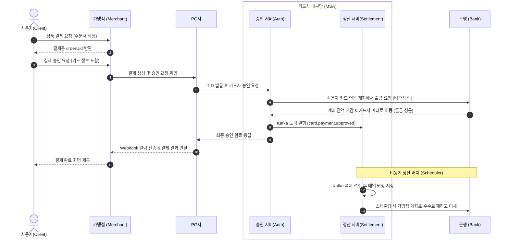

# 💸 Woori Payflow (우리 페이플로우) 통합 결제 시스템

이 프로젝트는 사용자가 쇼핑몰에서 상품을 결제하는 순간부터, PG사를 거쳐 카드사가 승인하고 최종적으로 가맹점에게 정산 대금이 지급되기까지의 **모든 결제 및 자금 흐름**을 스프링 부트 환경에서 구현한 데모 시스템입니다.

---

## 🏗 1. 아키텍처 의사결정 (Why We Did This)

본 프로젝트는 각 도메인의 특성에 맞춰 **모놀리식(Monolithic)** 구조와 **마이크로서비스(MSA)** 를 혼용하여 구성했습니다.

### 1) 왜 PG사는 모놀리식으로, 카드사는 MSA로 나누었는가?
* **PG 서버 (Monolithic)**: 시간 관계상 복잡도를 낮추어 개발 생산성과 안정성을 높이려 모놀리식을 택했습니다.
* **카드 서버 (MSA)**: 카드사는 **"실시간 결제 승인(가벼움/매우 빠름)"** 과 **"익일 자금 정산(무거움/배치)"** 이라는 전혀 다른 두 가지 성격의 트랜잭션을 감당해야 합니다. 트래픽이 몰릴 때 '승인 서버'만 유연하게 스케일 아웃(Scale-out)할 수 있도록 두 도메인을 완벽히 분리하였습니다.

### 2) 왜 Spring Cloud Kafka Binding을 사용했는가?
* **비동기 결합도 완화**: 만약 승인 서버가 정산 서버로 직접 API(REST)를 호출한다면, 정산 서버가 죽었을 때 결제 승인까지 통째로 실패합니다.
* **이벤트 기반 설계(EDA)**: 승인 서버는 결제가 성공했다는 사실(`card.payment.approved`)만 Kafka에 브로드캐스트하고 바로 사용자에게 응답을 줍니다. 정산 서버는 본인의 여력이 될 때 이 이벤트를 주워와 안전하게 저장하므로 장애 격리와 응답 속도 향상이라는 두 마리 토끼를 잡을 수 있습니다.

### 3) 왜 카드 서버 그룹 내부에 Eureka와 Config Server를 두었는가?
* **Eureka (Service Discovery)**: MSA 환경에서는 여러 인스턴스가 떴다 지길 반복합니다. 승인 서버들이 3~4개로 늘어날 경우, 각 서버의 IP 주소를 하드코딩하지 않고도 다이나믹하게 로드 밸런싱하고 위치를 찾기 위해 Registry를 도입했습니다.
* **Config Server (중앙 집중식 설정)**: 서브 모듈들(`auth`, `settlement` 등)이 공통으로 사용하는 DB 주소, Kafka 토픽 변수 등을 각 서버 소스코드에 분산시키지 않고 한 곳에서 관리하기 위함입니다. 이를 통해 환경 변수 변경 시 서버를 재빌드할 필요가 사라집니다.

---

## 🌊 2. 결제 데이터 흐름 (Sequence Diagram)



---

## 🏢 3. 주요 서버 구성 및 역할
* **Bank Server (`bank-service`)**: 실제 금전이 오가는 최하단 인프라 모의 서버. 사용자, 카드사, 가맹점 계좌 잔액을 관리하고 출금/이체 API를 제공합니다.
* **Merchant Server (`merchant-server`)**: 쇼핑몰 서버. 고객 주문 처리 및 카드 정보를 받아 PG사로 위임합니다.
* **PG Server (`pg-server`)**: 가맹점 결제 대행. 가맹점 API 키를 관리하고 고유 결제번호(TID) 생성, 웹훅 콜백을 발송합니다.
* **Eureka & Config Server**: MSA 인프라 관리용 서버.
* **Card Authorization**: 카드 및 PIN 유효성을 실시간 검증하고 은행에 출금을 지시합니다. (동기)
* **Clearing & Settlement**: Kafka 이벤트를 소비해 원장을 만들고 가맹점 정산금을 송금합니다. (비동기)

---

## 🚀 4. 빌드 및 실행 가이드

모든 서버는 기동 시 **별도의 SQL 실행 없이 앱 내장 설정(`data.sql` 및 `always` 옵션)** 을 통해 DB 스키마와 테스트 필요 요건(가맹점, 계좌, 카드 데이터)을 자동 생성합니다.

### 1단계: 인프라 실행 (Kafka)
Kafka 컴포즈 파일이 위치한 카드-승인 서비스 폴더로 이동하여 구동합니다.
```bash
cd card-server/card-authorization-service
docker-compose up -d
cd ../..
```

### 2단계: 데이터베이스 생성 (단 1회)
최초 1회에 한해, 툴(DBeaver 등)을 이용해 빈 디비 껍데기 5개를 만들어 줍니다.
```sql
DROP DATABASE IF EXISTS merchant_db;
DROP DATABASE IF EXISTS pg_db;
DROP DATABASE IF EXISTS card_authorization_db;
DROP DATABASE IF EXISTS clearing_settlement_db;
DROP DATABASE IF EXISTS bank_db;

CREATE DATABASE merchant_db; CREATE DATABASE pg_db; 
CREATE DATABASE card_authorization_db; CREATE DATABASE clearing_settlement_db; CREATE DATABASE bank_db;
```

### 3단계: 애플리케이션 기동
반드시 아래의 의존성 순서대로 서버를 기동해야 에러가 발생하지 않습니다. (IDE의 다중 실행 기능을 권장합니다.)
> 1. `eureka-server` (8761) ➔ 2. `config-server` (8888) ➔ 3. `bank-service` (8086) ➔ 4. `card-authorization-service` (9090) ➔ 5. `clearing-settlement-service` (9091) ➔ 6. `pg-server` (8090) ➔ 7. `merchant-server` (8091)

---

## 📝 5. 부록 (Appendix): 테스트 시나리오 및 케이스 검증

### [공통] 1단계: 주문서 생성하기 (가맹점)
```bash
curl -X POST http://localhost:8091/orders \
-H "Content-Type: application/json" \
-d '{ "productName": "MacBook Pro", "amount": 8888 }'
```
*(성공 시 반환되는 `"orderUid": "ORDER-xxxxx"` 값을 복사해 둡니다.)*

---

### Case 1. 결제 성공 (잔액이 충분하고 회원 정보 일치)
👉 **시나리오**: 사용자가 정상적인 체크 카드로 결제하고 출금과 정산 큐잉까지 완벽하게 이루어집니다.

#### 📝 쉽게 읽는 결제 흐름
**[1단계: 결제 승인 - "현금 확보"]**
실시간으로 사용자의 통장에서 돈이 나가는 과정입니다.
* **사용자 → 가맹점**: "이 맥북 살게요. 제 카드 번호는 4111... 이에요."
* **가맹점 → (PG) → 카드사**: "이 사람 결제 가능한가요? 카드사에서 좀 확인해 주세요."
* **카드사 → 은행**: "이 카드 번호랑 연결된 계좌에 잔액 8,888원 있나요? 있으면 바로 출금해 주세요." (여기서 계좌-카드 매핑이 사용됨)
* **은행**: 계좌 잔액을 깎고, 돈을 카드사의 공용 계좌로 옮겨둡니다. 그리고 "성공!"이라고 답합니다.
* **은행 → 카드사 → (PG) → 가맹점**: "결제 성공했습니다!" (사용자는 결제 완료 화면을 봅니다.)

**[2단계: 정산 - "가맹점에 입금"]**
카드사가 보관 중인 돈을 가맹점에게 실제로 전달하는 과정입니다 (비동기 처리).
* **카드사 (승인 서비스) → Kafka**: "방금 M001 가맹점에서 8,888원 결제 성공했음!" 하고 쪽지를 던집니다.
* **카드사 (정산 서비스)**: 쪽지를 주워서 "아하, M001 가맹점에 돈을 줘야겠군" 하고 기록합니다.
* **카드사 (정산 서비스) → 은행**: "카드사가 보관 중인 돈 중에서 수수료 떼고 남은 돈을 M001 가맹점 계좌로 이체해 줘."
* **은행**: 카드사 계좌에서 가맹점 계좌로 돈을 옮깁니다. (정산 완료!)

#### 🛠 테스트 실행 (cURL)
```bash
curl -X POST http://localhost:8091/payments \
-H "Content-Type: application/json" \
-d '{
"orderUid": "[위에서 복사한 ORDER-xxxxx]",
"cardNumber": "4111111111111111",
"expiryYear": "2027",
"expiryMonth": "12",
"birthOrBizNo": "900101",
"cardPassword2Digits": "1234",
"installmentMonths": 0
}'
```

---

### Case 2. 결제 실패 (잔액 부족 에러)
👉 **시나리오**: 돈이 없는 상태에서 맥북을 사려고 시도하는 경우, 은행에서 거절당합니다.
* **테스트**: 위 Case 1 명령어에서 금액(amount)을 수백만 원짜리로 만든 주문서(`orderUid`)를 하나 더 생성한 후, 똑같은 결제 요청을 날려 봅니다.
* **결과**:
  - `bank-server` 로그: 잔액 한도를 초과했다는 에러를 뱉고 출금 롤백(Rollback).
  - `card-authorization` 로그: 은행의 예외를 캐치하여 가맹점(PG)에 최종 '결제 실패'를 응답.
  - 정산 서버로 쪽지가 넘어가지 않아 정산 데이터도 생성되지 않음.

---

### Case 3. 결제 실패 (비밀번호 불일치 에러)
👉 **시나리오**: 훔친 카드를 사용하여 패스워드를 아무거나 입력하는 경우, 앱이 사전에 방어합니다.
* **테스트**: 위 명령어에서 `"cardPassword2Digits": "1111"`로 변경하여 요청을 날려봅니다.
* **결과**:
  - `card-authorization` 로그: DB에 암호화된 비밀번호와 불일치함 판단! **은행 서버(Bank)에 API 찔러보기조차 하지 않고 즉시 차단.**
  - 무의미한 네트워크 트래픽 낭비와 은행망 부하를 막는 방어 로직의 역할을 관찰할 수 있음.
