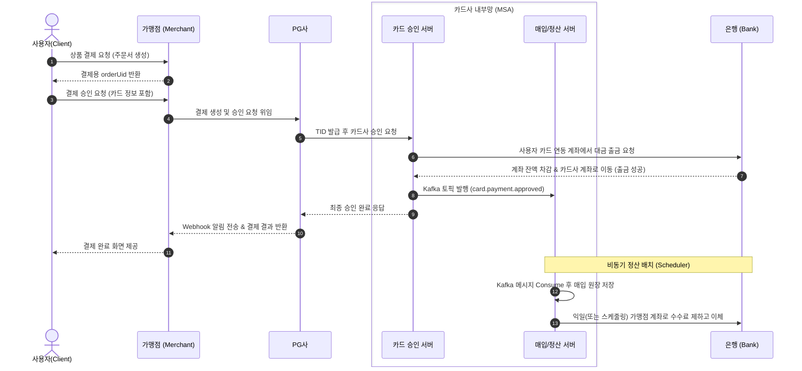

# 💸 Woori Payflow (우리 결제 시스템)

이 프로젝트는 사용자가 쇼핑몰에서 상품을 결제하는 순간부터, PG사를 거쳐 카드사가 승인하고 최종적으로 가맹점에게 정산 대금이 지급되기까지의 **모든 결제 및 자금 흐름**을 스프링 부트 환경에서 구현한 데모 시스템입니다.

---

## 🏗 1. 시스템 아키텍처 및 개요

본 시스템은 결제 구간의 성격에 따라 **모놀리식(Monolithic)** 서버와 **마이크로서비스(MSA)**를 혼용하여 구성하였으며, 서버 간 결합도를 낮추기 위해 **Kafka** 메시지 브로커를 활용합니다.

- **PG 서버 (`pg-server`)**: 가맹점과 결제 내역을 단순하고 견고하게 관리하기 위해 **모놀리식(Monolithic)** 아키텍처로 구현되었습니다.
- **카드 서버 (`card-server`)**: 트랜잭션이 집중되고 확장이 빈번한 핵심 도메인이므로 **MSA (Microservices Architecture)** 구조로 구축되었습니다.
- **이벤트 기반 비동기 처리**: 카드사에서 승인(동기)이 떨어지면, 정산을 위한 데이터 처리는 **Apache Kafka**를 통해 이벤트(Event-Driven)로 넘겨 병목을 방지합니다.

### 🌊 결제 데이터 흐름 (Sequence)



---

## 🏢 2. 주요 서버 구성 및 역할 (Components)

결제 생태계를 구성하는 각 서버의 역할은 다음과 같습니다.

### 1) Bank Server (`bank-service`)
- 실제 금전(돈)이 오가는 최하단 인프라 모의 서버입니다.
- 사용자 계좌, 카드사 시스템 계좌, 가맹점 계좌의 잔액을 관리하고 출금/입금 API를 제공합니다.

### 2) Merchant Server (`merchant-server`)
- 고객(User)을 직접 응대하는 쇼핑몰 도메인입니다.
- 장바구니/주문서를 생성하고, 고객의 신용카드 정보를 PG사에 넘겨 결제를 위임합니다.

### 3) PG Server (`pg-server`)
- 가맹점들의 결제를 대행하는 Payment Gateway 모의 서버입니다. (모놀리식 구조)
- 여러 가맹점의 API 키를 관리하고 결제 고유 번호(TID)를 생성하며, 결제 완료 후 가맹점에게 Webhook으로 통지합니다.

### 4) Card Server 그룹 (MSA 환경)
카드사 도메인은 확장성을 위해 서브 모듈들로 세분화되어 있습니다.
- **💡 Eureka Server (`eureka-server`)**: 카드사 내부 마이크로서비스들의 주소를 자동 동적 등록/탐색해 주는 Service Registry.
- **🛠 Config Server (`config-server`)**: 서비스들의 `application.yml` 환경 설정값을 중앙 집중식으로 관리하는 서버.
- **💳 Card Authorization (`card-authorization-service`)**: 실시간 카드 번호 및 PIN 번호를 검증하고 은행에 출금을 지시하는 '승인' 전담 서버.
- **💰 Clearing & Settlement (`clearing-settlement-service`)**: 승인 완료 이벤트를 Kafka로 섭취하여 가맹점 수취 계좌를 계산하고, 은행에 정산(지급) 이체를 지시하는 '매입/정산' 전담 서버.

---

## 🚀 3. 빌드 및 실행 가이드

프로젝트를 로컬 환경에서 실행하기 위한 순서입니다.

### Step 1. 인프라 실행 (Kafka & Zookeeper)
비동기 메시징 처리를 위해 도커 컴포즈로 Kafka를 구동합니다.
```bash
# 프로젝트 최상단 디렉토리에서
docker-compose up -d
```

### Step 2. 데이터베이스 설정 (DB Reset)
각 애플리케이션은 기동 시 자동으로 `data.sql`을 통해 필수 테스트 데이터를 인서트하도록 설정되어 있습니다. 따라서 처음 세팅 시 아래 스크립트를 MySQL 벤치/DBeaver에서 **한 번만 실행하여 빈 DB를 뚫어주시기 바랍니다.**

```sql
DROP DATABASE IF EXISTS merchant_db;
DROP DATABASE IF EXISTS pg_db;
DROP DATABASE IF EXISTS card_authorization_db;
DROP DATABASE IF EXISTS clearing_settlement_db;
DROP DATABASE IF EXISTS bank_db;

CREATE DATABASE merchant_db;
CREATE DATABASE pg_db;
CREATE DATABASE card_authorization_db;
CREATE DATABASE clearing_settlement_db;
CREATE DATABASE bank_db;
```

### Step 3. 애플리케이션 기동 (Boot Run)
**반드시** 아래의 의존성 순서대로 서버를 기동해야 합니다. (IDE의 다중 실행 기능을 권장합니다.)

1. `eureka-server` (포트: 8761)
2. `config-server` (포트: 8888)
3. `bank-service` (포트: 8086)
4. `card-authorization-service` (포트: 9090)
5. `clearing-settlement-service` (포트: 9091)
6. `pg-server` (포트: 8090)
7. `merchant-server` (포트: 8091)

모든 서버가 구동완료되면 `http://localhost:8761`에 접속하여 카드사 MSA 서비스들(`CARD-AUTHORIZATION-SERVICE`, `CLEARING-SETTLEMENT-SERVICE` 등)이 잘 등록되었는지 확인합니다.

---

## 📝 4. 부록 (Appendix): 테스트 시나리오

앱이 모두 준비되었다면 터미널(또는 포스트맨)을 이용해 아래 순서로 cURL을 날려 결제 파이프라인 전체를 테스트해 볼 수 있습니다.

### Case 1. 결제 주문서 만들기
가맹점(쇼핑몰)에 사고자 하는 물건의 가상 주문을 만듭니다.
```bash
curl -X POST http://localhost:8091/orders \
-H "Content-Type: application/json" \
-d '{
"productName": "MacBook Pro",
"amount": 8888 
}'
```
> 결과 예시: `{"orderUid":"ORDER-E630B97A", ...}` 

### Case 2. 카드 승인 요청 치기
위에서 돌려받은 `orderUid`를 넣은 채, 가맹점에서 세팅해둔 테스트용 카드(4111...)로 실제 승인을 찍어봅니다.
```bash
curl -X POST http://localhost:8091/payments \
-H "Content-Type: application/json" \
-d '{
"orderUid": "ORDER-E630B97A",  // 위 결과창에서 받은 값 복사
"cardNumber": "4111111111111111",
"expiryYear": "2027",
"expiryMonth": "12",
"birthOrBizNo": "900101",
"cardPassword2Digits": "1234",
"installmentMonths": 0
}'
```

### Case 3. 흐름 검증하기 (어디를 보아야 할까?)
1. **은행 서버(`8086`) 로그 확인**: 사용자 조회 및 실제 `1000000001`번 계좌에서 잔액 `8,888`원이 깎이는지(비관적 락 출금) 봅니다.
2. **카드사 승인 서버(`9090`) 로그 확인**: 완료 직후 Kafka `card.payment.approved` 토픽에 메시지를 쏘는 발행(Publish) 로그를 봅니다.
3. **매입 정산 서버(`9091`) 로그 확인**: 별도로 통신한 적이 없음에도 백그라운드에서 Kafka 메시지를 낼름 주워먹고 매입 내역(Clearing)을 DB에 인서트하는 걸 확인합니다.
4. **PG 및 가맹점 서버 로그 확인**: 웹훅 발송 이력과 함께 최종 화면결과가 SUCCESS로 떨어지는지 확인합니다.